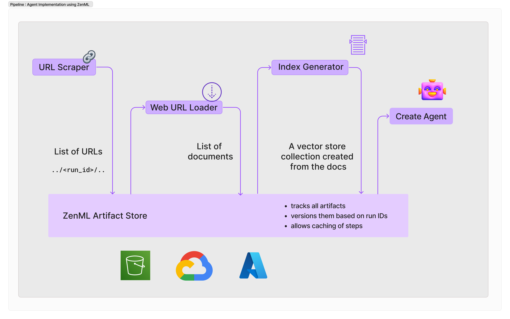
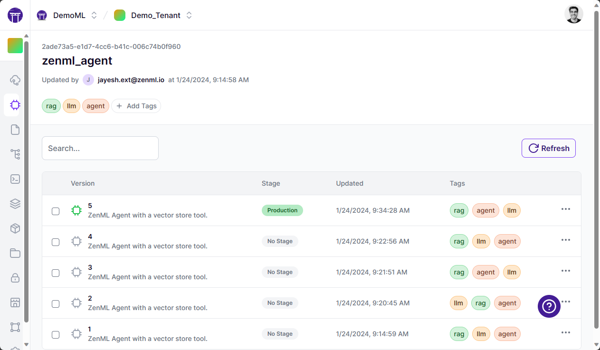

# Creating a production-ready LLM-powered Agent with ZenML

Agents are applications that allow the LLMs to act on their thoughts through the use of tools or functions. The LLM figures out what to do and what action to perform, choosing from a list of available options, and then the LLM framework facilitates the exchange of data between the system and the model.

Agentic applications are on the rise because with the right set of tools, they can become a really powerful way to utilize LLMs. Frameworks like LangChain and Llamaindex offer abstractions to build agents and also host a variety of tools that you can use right out of the box. However, just those frameworks alone aren't enough.

## 😯 Challenges with productionizing LLM Agents

In principle, the agents with a question-answering tool work on the Retrieval Augmented Generation concept (RAG) which is popularly implemented in many frameworks and projects.
Upon a closer look and while using the agents in production, however, we need to address some challenges.

- Data that powers the agent's answering ability is constantly changing, new information comes in every day.
- Not feasible to manually generate vector stores based on the changing data. There's a need for automation.
- Tracking code changes to the vector store creation logic is important as it allows you to tie your outputs to the embeddings model and the other settings that you use.
- Tracking and versioning the agents that are created helps you manage what agents are used in production and allows easy switching.
- Important metadata like the agent's personality, the model parameters used for the LLM powering the agent, the type of vector store used, are essential while performing experiments to find the best performing combination.


## ZenML 🤝 LLM frameworks

There are various terms being tried out to describe this new paradigm — from LLMOps to Big Model Ops. We wanted to experience how users of ZenML might go about using our framework to integrate with these tools and models. We had seen lots of demos showcasing useful and striking use cases, but none were some of the complexities around deploying these in production were raised.

What we showcase in this project is a way to build a pipeline around the vector store, and consequently the agent creation . This allows us to automate all the manual steps, among other benefits like making use of caching, tracking artifacts and more!

## The Agent Creation Pipeline



We build a ZenML pipeline to handle data ingestion, construct the vector store, and save the resulting data in the ZenML artifact store. We then create an Agent using the vector store as one of its tools. The pipeline consists of the following big-picture actions:

- Data Ingestion: We use the `langchain` framework to load a series of documents from various sources such as GitHub and Slack. This data will serve as the basis for our vector store.
- Vector Store Construction: Once the data is ingested, we apply the necessary preprocessing and transform it into a suitable format for querying. We then use the large language models to create a vector store, which will enable us to search and retrieve relevant information efficiently.
- Creating an Agent: We then create an agent object using the vector store as one of its tool, which would empower it to answer questions about ZenML.

ZenML stores the outputs of all the steps in an artifact store that you configure as part of your ZenML stack and makes them available across all other steps.


### Data Sources

We thought about the kinds of data sources we'd want to be queried when users entered their queries. We take a lot of pride and effort to maintain our documentation so that was an obvious one to include. We considered adding [the `README` files of our `examples`](https://github.com/zenml-io/zenml/tree/main/examples) since that's often a starting point for our users, and we thought [our release notes](https://github.com/zenml-io/zenml/blob/main/RELEASE_NOTES.md) would also be useful to be part of the context.

Getting all of this together was not too hard, and LangChain has functions that help with obtaining Slack messages and documentation from Gitbook. In the end we wanted more flexibility than was available from the pre-built document loaders, so we just used the generic loader for web content along with a custom scraper to get a list of all URLs available for our docs and examples READMEs.

### Vector Store

We settled on using a vector store as the way to query our documentation. This seems to be a common way to do this when your texts are quite large. You don't want to have to send your entire corpus over to OpenAI (or whoever is providing your LLM) since most of it will be irrelevant to the specific question at hand. Instead, what you want is a way to get only the top handful of useful chunks of information and pass them on to your LLM along with a prompt and the original question.

We used the [FAISS](https://faiss.ai) Vector Store. FAISS (Facebook AI Similarity Search) is a library developed by Facebook AI Research for efficient similarity search and clustering of high-dimensional vectors. It is particularly useful for tasks that involve large-scale information retrieval or finding nearest neighbors in high-dimensional spaces. Moreover, it's fast and open-source and was quite well documented for this use case. (LangChain and Llama Index have quite a few other options, particularly if you want your vector store hosted and deployed somewhere in the cloud.)

The documents downloaded in earlier steps are split up into small 1000-character chunks, then combined together with embeddings and fed into the vector store. This special combination is what allows us to query a large corpus of text.

### Agent

An agent is essentially the part of the LLM application that coordinates or orchestrates the communication between the LLM and a set of tools. It gives the LLM the power to run functions and makes the outputs of those functions available back to the model for further tasks or for constructing a final answer.

We can choose to write an agent ourselves, or use any abstraction from one of the LLM frameworks like LangChain. We used the `ConversationalChatAgent` class defined by LangChain which is based on the base agent abstraction. We can customise the agent using the prompt that is supplied to it on creation. You can see that we use characters as a way to influence the style of output of the model.

## ZenML Cloud

The [ZenML Cloud](https://www.zenml.io/cloud) offers multi-tenant, fully-managed ZenML deployments. The servers come with a host of advanced features like built-in roles for access control, a new dashboard for monitoring and visualizing your pipelines, a model control plane that tracks your ML models across pipelines along with all the artifacts and metadata associated with them, and much more.

You can sign up for a free trial of the cloud at https://cloud.zenml.io. Once signed up you can connect to it using the command below.

### Models Tab in the Dashboard

The models tab acts as a central control plane for all of your models. You can view the different versions that get created implictly with your pipeline runs, check their metadata, deployments and more!



A model version can have one of the following stages: Staging, Production, Archived, No stage. The Dashboard allows you to easily promote a version to either staging and production. The model can then be consumed by another pipeline that serves whatever the production model is.


Clicking on a model version can show you more details, like the metadata associated with it. In the case of this project, you can find the questions that are asked to a specific version of the agent and the answers that the agent supplies, attached as metadata. This is super helpful when you want to track the quality of responses over different experiments.


## Installation

Install the required packages via the `requirements.txt` file located in the
`/src` directory.

```bash
pip install -r src/requirements.txt
```

## Running it locally

After the installation is completed, you directly run the pipeline locally
right away.

```bash
python src/run.py
```

Note that the pipeline is configured to generate artifacts relating to ZenML's
documentation and examples. If you want to adapt this project to generate
artifacts for your own data, you can change values as appropriate.

## Running it on GCP

It is much more ideal to run a pipeline like the agent creation pipeline on a regular schedule. In order to achieve that, 
you have to [deploy ZenML](https://docs.zenml.io/user-guide/production-guide/deploying-zenml) 
and set up a stack that supports 
[our scheduling
feature](https://docs.zenml.io/how-to/build-pipelines/schedule-a-pipeline). If you
wish to deploy the slack bot on GCP Cloud Run as described above, you'll also
need to be using [a Google Cloud Storage Artifact
Store](https://docs.zenml.io/stack-components/artifact-stores/gcp). Note that
certain code artifacts like the `Dockerfile` for this project will also need to
be adapted for your own particular needs and requirements. Please check [our docs](https://docs.zenml.io/how-to/setting-up-a-project-repository/best-practices) 
for more information.
